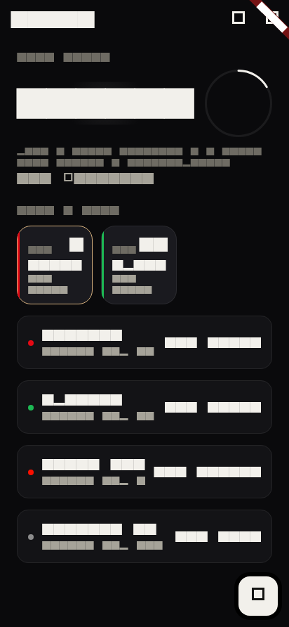
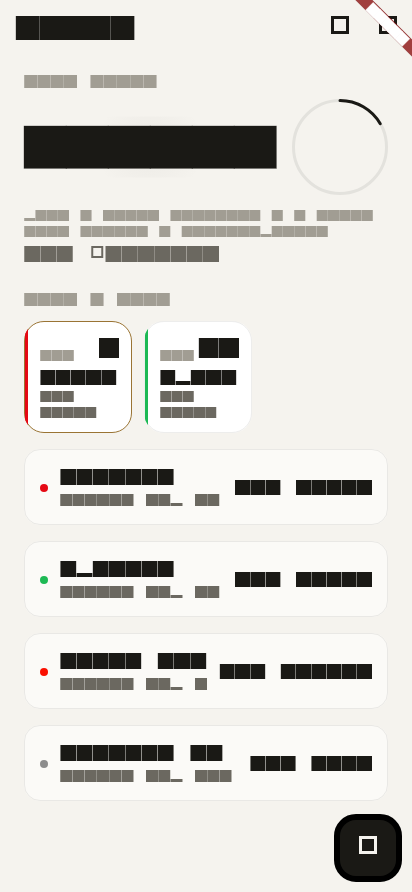

# Subly (working title)

An Android subscription tracker built with Flutter + Firebase: a monochrome
dark ledger for manual-entry subscriptions with per-currency monthly/annual
totals, on-device reminders before renewals and free-trial end dates, a seeded
directory of cancellation links, and a simulated premium tier (unlimited
subscriptions + CSV export).

| Dark (default) | Light |
| --- | --- |
|  |  |

## The design

One token sheet (`lib/core/theme.dart`) drives both themes: a monochrome
night ledger — near-black surfaces, warm-white ink, hairline borders, zero
shadows — with a single thread of chroma (per-service brand dots and muted
status tints). Space Grotesk carries the display and money figures (tabular,
so columns align); Inter handles body and labels. Motion is cinematic calm:
ease-out only, 40ms staggers, haptic ticks — with three set pieces: the
count-up hero total with its month-pace ring, the staggered ledger with
card-morph into the edit screen, and the paywall's light-sweep reveal.

## Setup

```bash
flutter pub get
flutterfire configure --project=subly-dev --platforms=android   # config already generated; re-run to refresh
flutter test        # full test suite (fake Cloud Firestore, no emulator needed)
flutter run -d android
```

Seed the cancellation directory (writes are blocked for clients by
firestore.rules, so seeding runs server-side):

1. Firebase console -> Project settings -> Service accounts -> Generate new
   private key -> save as `scripts/serviceAccountKey.json` (git-ignored).
2. `cd scripts && npm install firebase-admin && node seed_cancellation_links.js`

## Demo checklist

1. Fresh install -> sign-in wall (the S monogram) -> Google Sign-In ->
   empty dashboard.
2. Add subscriptions; the 6th is blocked by the free limit -> paywall ->
   choose Monthly -> the 6th saves.
3. Add a subscription with a free trial; reminder fires before the trial ends.
4. Dashboard: the total counts up with the month-pace ring; per-currency
   totals; NEXT 7 DAYS strip flags renewals <3 days out.
5. Tap a ledger card -> it morphs into the pre-filled edit screen.
6. Directory (link icon) lists cancellation pages; tapping opens the browser.
7. Settings -> CSV export copies to clipboard; theme toggle (dark/light);
   Sign out returns to the wall.
8. Cross-user Firestore access is rejected by security rules.

## Plans & docs

- `docs/superpowers/plans/2026-09-06-subly-mvp.md` — architecture phase (implemented)
- `docs/superpowers/plans/2026-09-06-subly-design.md` — design phase (implemented)
- `AGENTS.md` — architecture map, design-system rules, and framework gotchas for agents

Deferred device checks: sign-in flow on real hardware, a notification actually
firing, the 60fps profile pass, and the demo checklist run end-to-end.
